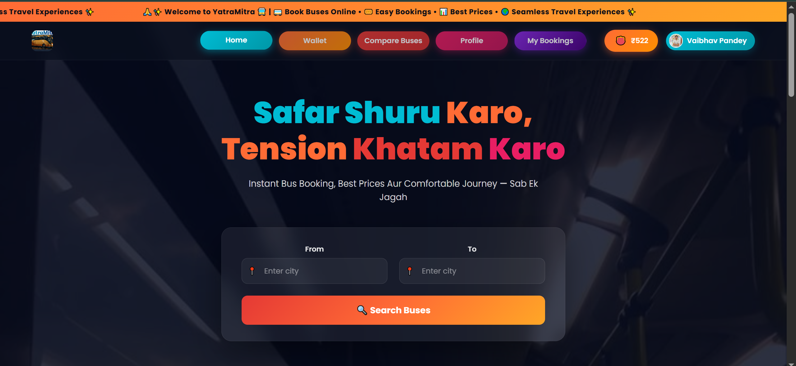
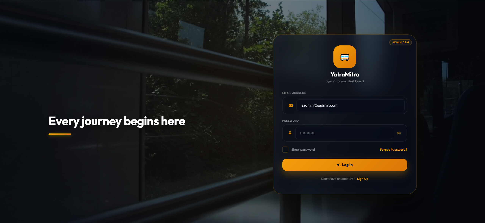

# 🚍 YatraMitra - Online Bus Booking Platform

YatraMitra is a comprehensive, premium online bus booking platform. This repository contains the complete ecosystem, including the backend API, the CRM Dashboard, and the Next.js Client Portal.

### 🌐 Live Production Links
* **Client Frontend Website**: [yatramitraclient.vercel.app](https://yatramitraclient.vercel.app)
* **CRM Admin Dashboard**: [yatramitracrm.netlify.app](https://yatramitracrm.netlify.app)

## 📱 Previews

### Client Portal (Next.js)


### CRM Admin Dashboard (React)


## 🚀 Technology Stack
* **Client Portal**: Next.js (SSR), React, Vanilla CSS
* **CRM Admin Portal**: React SPA (Single Page Application)
* **Backend API**: Node.js, Express, Mongoose, MongoDB
* **Real-time Engine**: Socket.io (for real-time seat tracking and map sync)
* **Payment Gateway**: Razorpay Integration

---

## 🛠️ Project Setup & Installation

### 1. Backend Server Setup
1. Navigate to the `server` folder:
   ```bash
   cd server
   ```
2. Install dependencies:
   ```bash
   npm install
   ```
3. Create a `.env` file inside the `server` directory and add the following keys:
   ```env
   MONGO_URI="your_mongodb_connection_string"
   userEmail="your_gmail_address"
   userPass="your_gmail_app_password"
   JWT_SECRET="your_jwt_secret"
   RAZORPAY_KEY_ID="your_razorpay_key_id"
   RAZORPAY_KEY_SECRET="your_razorpay_key_secret"
   ```
4. Start the backend server:
   ```bash
   npm run server
   ```

### 2. Client Portal Setup
1. Navigate to the `client` folder:
   ```bash
   cd client
   ```
2. Install dependencies:
   ```bash
   npm install
   ```
3. Run the development server:
   ```bash
   npm run dev
   ```

### 3. CRM Dashboard Setup
1. Navigate to the `CRM` folder:
   ```bash
   cd CRM
   ```
2. Install dependencies:
   ```bash
   npm install
   ```
3. Start the dashboard:
   ```bash
   npm start
   ```

---

## 💎 Features
* **Real-Time Seating Sync**: Interactive seat map powered by Socket.io that locks/unlocks seats instantly as users select them.
* **Gender-Based adjacent Seat Locking**: Prevents male/other bookings adjacent to female reserved seats to ensure safety.
* **Email E-Ticket Invoicing**: Automatic beautiful HTML e-ticket dispatch via Nodemailer upon successful booking.
* **Dynamic Surge & Discount Engine**: Automatic 10% weekend surges and 15% last-minute discount pricing rules.
* **Referral & Cashback System**: 5% automatic wallet cashbacks on bookings and ₹100/₹50 user referral bonuses.
* **Multi-Platform Comparison Engine**: Live rate comparison table against Paytm, RedBus, and AbhiBus.